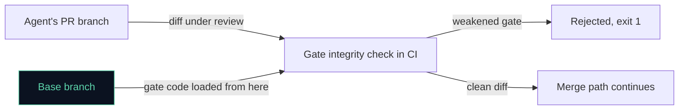

<p align="center">
  
</p>

<h1 align="center">Modonome</h1>

<p align="center"><strong>The autonomous engineering loop that arms only on your command, sends every change through an independent checker, and blocks the known structural ways agents weaken tests.</strong></p>

<p align="center">
When armed, it finds tech debt your team keeps deferring and proposes bounded pull requests.
A CI gate integrity check, run from a base-branch copy the agent's run does not control,
rejects diffs that structurally weaken tests or gates: removed assertions, injected skips,
type escapes, lowered coverage. Maker, checker, and merge authority are structurally
separate, enforced in CI. Off by default, and it runs without a central service.
</p>

<p align="center">
  <a href="https://modonome.com">Website</a> ·
  <a href="QUICKSTART.md">Quickstart</a> ·
  <a href="ADOPTION-GUIDE.md">Adoption guide</a> ·
  <a href="SECURITY.md">Security</a> ·
  <a href="agentproof/README.md">AgentProof</a> ·
  <a href="#everything-else">All docs</a>
</p>

<p align="center">
  <a href="https://github.com/enumind/modonome/actions/workflows/ci.yml"></a>
  <a href="https://www.npmjs.com/package/modonome"></a>
  <a href="LICENSE"></a>
  <a href="agentproof/README.md"></a>
  <a href="https://scorecard.dev/viewer/?uri=github.com/enumind/modonome"></a>
</p>

---

<p align="center">
  
</p>
<p align="center"><sub>Real output. The diffs and the verbatim rejection are committed in
<a href="examples/demo-app/runs/2026-07-08T05-30-00Z/">examples/demo-app/runs/2026-07-08T05-30-00Z/</a>
and reproduce deterministically: no model involved.</sub></p>

Autonomous coding agents have a predictable failure mode: they weaken gates to go green (removing test assertions, adding skips, loosening type checks). Modonome blocks the known structural forms of that in CI: the anti-gaming ratchet runs from a base-branch copy the agent's run does not control, and it rejects diffs that structurally weaken a gate. We published the [governed-autonomy spec](docs/specs/governed-autonomy-spec.md), and Modonome is the reference implementation for agent gate integrity, scoring **[25/25 on AgentProof](agentproof/README.md)**, our self-graded adversarial benchmark of known gaming patterns (hardening against those patterns, not third-party certification and not a certificate of full autonomy governance). The check is deterministic and narrow by design; [what it cannot catch](#what-it-catches-and-what-it-cannot) is documented rather than papered over.

## Try it in 60 seconds (read-only)

```bash
npx modonome dry-run .    # what work it would propose. Writes nothing.
npx modonome gauntlet .   # replay 25 known gate-weakening attacks against YOUR gates
```

The Gauntlet grades what your CI would actually catch today, with an honest denominator
(languages you don't use count as N/A, not as passes), and prints a share line and badge
snippet. The demo app goes from 0/3 UNHARDENED to 3/3 HARDENED by wiring one workflow file:
[before](examples/demo-app/runs/2026-07-08T05-30-00Z/gauntlet-before.txt) /
[after](examples/demo-app/runs/2026-07-08T05-30-00Z/gauntlet-after.txt).

**[See the walkthrough](examples/demo-app/WALKTHROUGH.md)**: a real Node.js app with planted tech debt. What the dry-run proposed, one recorded maker/checker cycle (distinct models, one real question raised by the independent checker), and a deterministic gate rejection, with every step backed by a committed evidence file.

## Add the gate to your CI in five minutes

The guardrail layer stands alone: any repo can adopt it without arming anything.

```yaml
name: gate-integrity
on:
  pull_request:
  merge_group:
jobs:
  gate-integrity:
    runs-on: ubuntu-latest
    permissions:
      contents: read
      security-events: write   # for the SARIF upload to code scanning
    steps:
      - uses: actions/checkout@v4
        with:
          fetch-depth: 0
      - uses: enumind/modonome@v1
```

Mark `Modonome Gate Integrity` a required check via a ruleset. It declares `merge_group`,
so it also reports in a merge queue. Findings render as SARIF in the Security tab with
stable `MR###` rule codes. Prefer a raw step? The check is one dependency-free script:
`npx modonome ratchet` (add `--sarif` or `--json`).

## How the trust boundary works

You can tell an agent to add tests. The agent can also remove assertions to make the tests
pass faster. A prompt can be overridden by a cleverer prompt; a CI gate that runs outside
the agent's write scope holds. Modonome makes that structural:



- The gate code is loaded from the **pinned base branch**, never from the pull request
  under review, so a PR cannot weaken the gate that judges it (verified by AgentProof
  scenario AP-19).
- The arming controls live in the `MODONOME_ARMED` environment variable, outside the
  agent's write scope. With it unset, `autonomy_enabled` is forced to false no matter
  what any config file says.
- Every enforcing script is a CODEOWNERS-protected path.

**How this compares.** Branch protection and required checks decide *whether* checks ran;
they do not notice a diff that quietly deleted the assertions those checks depend on.
LLM-judge review (an agent reviewing an agent) is a prompt, and prompts can be argued with.
Eval benchmarks (SWE-bench and kin) measure whether agents *can* code, not whether your CI
survives one that games it. The gate integrity check is the missing layer: deterministic,
diff-level, and running from code the agent cannot touch. It composes with all of the above.

## What it catches, and what it cannot

The ratchet is a deterministic, line-based diff analyzer. That makes it fast, dependency-free,
and immune to prompt injection. It also bounds what it can see. It catches **structural**
gate-weakening: removed or downgraded assertions, injected skips, type escapes, lowered or
deleted coverage thresholds, across JS/TS, Python, Java, and .NET. It does not catch
**semantic** weakening: an expected value quietly changed to match buggy output, an assertion
whose operands were loosened while its shape stayed intact, or a test rewritten to pass
vacuously.

Two layers cover that gap, and we say so rather than imply the ratchet does:

- The **independent checker** reviews every armed change with a distinct identity and model
  family; semantic review is its job, and the separation is enforced structurally, not by
  prompt (see [the loop](#the-loop-armed-mode)). Its catch rate on exactly these categories
  (expected-value drift, cross-file migration, vacuous-in-spirit assertions, scope creep) is
  measured, not assumed: **[CheckerProof](checkerproof/README.md)** is a seeded-defect benchmark,
  run live against the real configured checker, with a negative control so a checker that
  rejects everything cannot score well by accident.
- **The Gauntlet** (`npx modonome gauntlet .`) replays known weakening attacks against your
  repo's own files and scores your actually-configured gates, with an honest denominator:
  languages you don't use count as N/A, not as passes.

If you can construct a diff that weakens a gate and slips past the ratchet, we want it:
**[Break the Ratchet](BREAK-THE-RATCHET.md)**. Submissions are never executed, only text-analyzed
by the ratchet itself; a confirmed break is a named, credited hall-of-fame entry and, once fixed,
a new AgentProof scenario.

## The loop (armed mode)

1. **Adopt.** Read the host repo's instructions, CI, code owners, gates, and conventions, then defer to them.
2. **Dry-run.** Propose bounded work as a queue, read-only.
3. **Make.** A maker implements one tightly scoped work item with a failing test as the fence.
4. **Check.** An independent checker, separate from the maker in identity and model family, runs the gates and reviews the diff.
5. **Gate.** Deterministic gates and the gate integrity check run in CI, outside the agent.
6. **Owner.** Protected paths and new claims wait for a human decision.
7. **Merge.** A separate merge authority lands the change only when every gate is green.
8. **Learn.** Real corrections become staged lessons that an owner promotes into durable rules.

Defaults that stay in your control: autonomy off until an owner arms it through CI or
environment; auto-merge off; protected paths (CI, secrets, schemas, migrations, lockfiles,
auth) wait for owner review; model spend opt-in with local models first; cross-repo sharing
off.

**Status (v0.1-alpha):** the guardrail layer (ratchet, validators, CLI, GitHub Action,
AgentProof, Gauntlet) is stable and machine-verified. The maker/checker loop is fully wired
(`modonome-auto.yml`, `run-cycle.mjs`) and exercised end-to-end once on the demo app
([evidence](examples/demo-app/runs/2026-06-26T11-46-00Z/)): Haiku maker, Sonnet checker,
distinct model families, checker approved with one question raised. The cycle is recorded
as evidence, not applied to the sample. It has not yet run in armed mode on a live
production repository; that is v0.2. The full honest ledger of shipped versus planned is in
[ROADMAP.md](ROADMAP.md) and the [claims audits](docs/audits/).

## Development practice

This project is built solo, in public, with AI assistance, and governed by the same loop it
ships: every AI-authored pull request passed the same gates you see in CI, and the
[claims audits](docs/audits/) are written to be deliberately uncharitable to our own
marketing. We are not claiming adoption; we are claiming a mechanism, and inviting you to
break it. The attribution detector in the hygiene suite is not a confession, it is
dogfooding: an adopter-facing gate, run on ourselves to prove it works. The governance
process is the trust signal, not the identity of any tool involved.

Local development: `npm run verify` runs every gate (drift, style, hygiene,
self-application, work items, tests, AgentProof) with no network or secrets.

## Everything else

| Topic | Where |
|---|---|
| Five-minute setup, arming, MCP wiring, cost model | [QUICKSTART.md](QUICKSTART.md) |
| Adoption guide for teams | [ADOPTION-GUIDE.md](ADOPTION-GUIDE.md) |
| Architecture, host vs. self governance, execution contexts | [ARCHITECTURE.md](ARCHITECTURE.md) |
| Agents, roles, runners, models, budgets | [docs/agents.md](docs/agents.md) |
| AgentProof benchmark and spec | [agentproof/README.md](agentproof/README.md) |
| CheckerProof: measured checker efficacy, not assumed | [checkerproof/README.md](checkerproof/README.md) |
| Break the Ratchet: the public adversarial challenge | [BREAK-THE-RATCHET.md](BREAK-THE-RATCHET.md) |
| Governed-autonomy specification | [docs/specs/governed-autonomy-spec.md](docs/specs/governed-autonomy-spec.md) |
| Repo snapshot for LLM context (Merkle-verified) | [docs/adr/ADR-033-repo-snapshot.md](docs/adr/ADR-033-repo-snapshot.md) |
| Operator control panel (Milestone 3, in progress) | [apps/control-panel/README.md](apps/control-panel/README.md) |
| Enterprise estates (roadmap, not shipped) | [docs/enterprise.md](docs/enterprise.md) |
| Compliance mappings and evidence | [docs/compliance/compliance.md](docs/compliance/compliance.md) |
| Security policy | [SECURITY.md](SECURITY.md) · [GOVERNANCE.md](GOVERNANCE.md) |
| Versioning and safe upgrades | [docs/versioning.md](docs/versioning.md) |
| Roadmap and milestones | [ROADMAP.md](ROADMAP.md) |
| Contributing, support, and what a merge commits us to | [CONTRIBUTING.md](CONTRIBUTING.md) · [SUPPORT.md](SUPPORT.md) |

## License

MIT. See [LICENSE](LICENSE).
