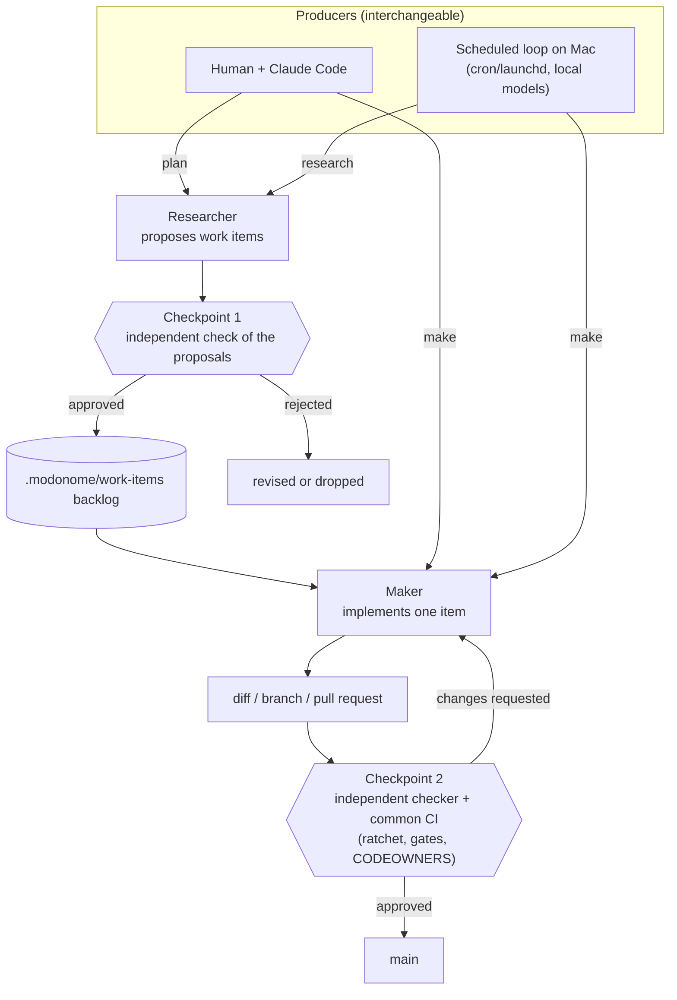

# ADR-040: The End-to-End Governed Operating Model

**Status:** Accepted  
**Date:** 2026-07-04  
**Milestone:** 5 (Market researcher and envisioner roles)  
**Builds on:** ADR-006 (checker independence), ADR-038 (checker as an author-agnostic review service), ADR-039 (agent capability profiles)

## Context

ADR-038 established that the trust boundary is the merge gate and that the internal loop, a
human, and a coding-agent session are interchangeable producers. ADR-039 made the crew
describable: maker, checker, researcher, and other agents, each with skills, tools, and a
prioritized model list. This ADR states the operating model those two imply, end to end, so
there is one canonical picture of how work flows from an idea to `main`.

The intended model is:

- A human works with Claude Code to initiate planning (a researcher activity) and/or repo
  changes (a maker activity); or the modonome loop wakes on a schedule (a cron or launchd job
  on a Mac) and runs researching, making, and checking on local models.
- Every one of those paths converges on the same common CI.
- A researcher's output is checked before it becomes work items in the backlog.
- A maker takes up an item from the backlog, executes it, and its output is cleared by a
  checker before it can merge.

The load-bearing idea is that this is one principle applied at two gates: nothing advances
without an independent check. It advances into the backlog only past a check of the proposal,
and onto `main` only past a check of the diff plus common CI.

## Decision

1. **Two producer channels are first-class and interchangeable.** Interactive (a human with
   Claude Code) and scheduled (a local cron or launchd loop on the Mac, running local models)
   are two ways to drive the same roles. Neither is privileged; both feed the same governance.

2. **Two governed checkpoints, each an independent check before advancement.**
   - **Checkpoint 1, research to backlog.** A researcher (from either channel) proposes work
     items. An independent check vets those proposals before they enter
     `.modonome/work-items/`. This is new; see the gap below.
   - **Checkpoint 2, make to merge.** A maker takes one item from the backlog and produces a
     diff. An independent checker plus the common CI suite clear it before it reaches `main`.
     This exists today.

3. **Common CI is Checkpoint 2's teeth and the single convergence point.** Every producer's
   change arrives as a pull request and passes the same `npm run verify` suite, branch
   protection, and CODEOWNERS review. There is no side channel to `main`.

4. **The maker channel may vary; the checks run regardless of producer.** Per ADR-038 and
   ADR-039, the checker and the researcher-check are author-agnostic: they run over a proposal
   or a diff whoever produced it, so integrity does not depend on which channel was used.

## The flow

## What exists, and the one gap

Built and live:

- Both producer channels. The interactive channel is proven (a Claude Code session produces a
  branch and pull request). The scheduled maker and checker loop exists in
  `.github/workflows/modonome-auto.yml`.
- Checkpoint 2 in full. `run-cycle.mjs` runs the maker then an independent checker; `ci.yml`
  runs the common `npm run verify` suite on every pull request; branch protection and
  CODEOWNERS are the merge gate. `scripts/agent/review-diff.mjs` (ADR-038) generalizes the
  checker to review any diff regardless of producer.
- The backlog and the maker's use of it. Work items are durable state under
  `.modonome/work-items/`; the maker claims and implements them through the state machine.
- The researcher as a capability profile (ADR-039), with skills, tools, and a prioritized
  model list, ready to run on local models.

The one gap:

- **Checkpoint 1 does not exist as a gated path.** Today work items are created by a
  deterministic sweep (`scripts/dry-run-sweep.mjs`, `proposalToWorkItem`) with no independent
  check before they enter the backlog. The intended model puts a check between a researcher's
  proposals and the backlog, the same way Checkpoint 2 sits between a maker's diff and `main`.
  This is tracked as WI-044.

Deployment note for the scheduled channel: `modonome-auto.yml` runs on `ubuntu-latest`, which
cannot reach a LAN-only local model on the Mac. Running the scheduled loop on local models needs
either a self-hosted runner on the Mac or a local cron or launchd driving `run-cycle.mjs`, as
already documented for the Phase B arming path. That is a deployment choice, not a code gap.

## Consequences

- The system has one legible picture: many producers, two checkpoints, common CI. A reviewer
  or an operator can reason about any change by asking which checkpoint it is at.
- Closing Checkpoint 1 (WI-044) makes the researcher a governed producer symmetrically with the
  maker: a proposal is to the backlog what a diff is to `main`.
- Both checkpoints reuse the same author-agnostic checker machinery, so there is one review
  mechanism to harden (prompt injection, anti-rubber-stamp telemetry) rather than two.
